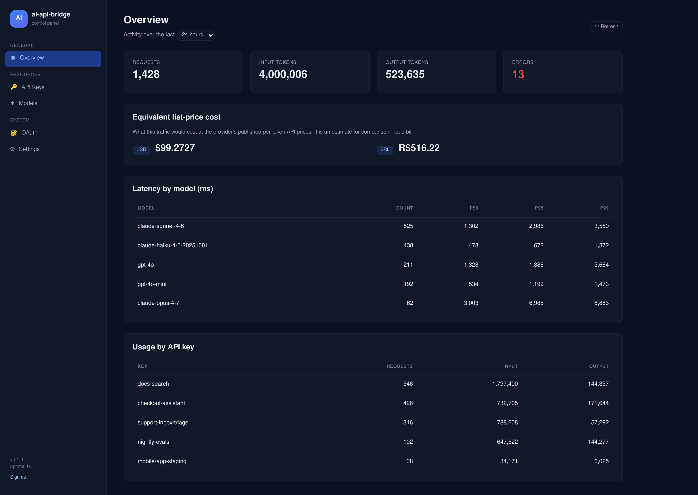
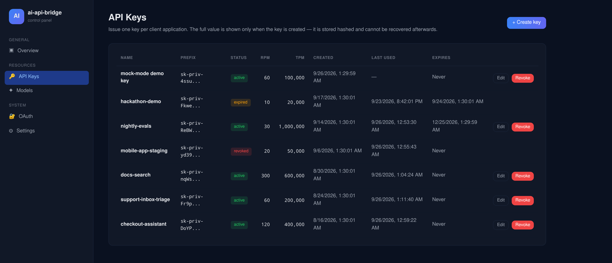
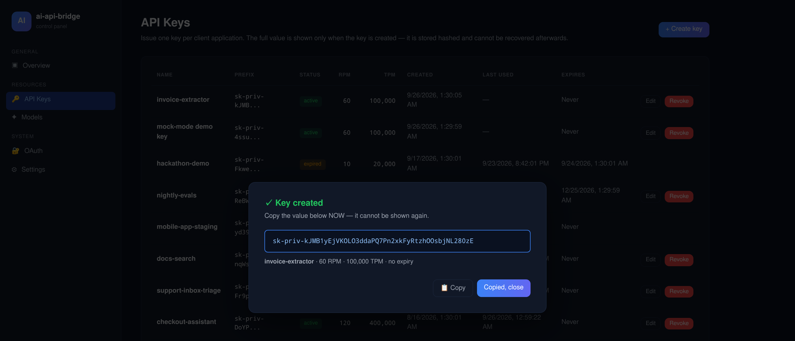

# ai-api-bridge

[](https://github.com/eranoix/ai-api-bridge/actions/workflows/ci.yml) [](LICENSE)  

**A bridge that lets a program written for one AI API talk to another, without changing its code.**

*In plain words:* Programs that use an AI service talk to it through a set of rules, and each company that sells AI has its own set. A program built for one company normally has to be rewritten before it can use another. This bridge sits in the middle and translates between the two, in both directions. Developers can switch providers without touching their program, and a small dashboard shows who is using the service and how much.

One endpoint, two protocols. Speak OpenAI's `/v1/chat/completions` or
Anthropic's `/v1/messages` to the same service and it translates in both
directions, including streaming, tool use and image parts.

<p align="center"></p>

## Quick start

You need **Node.js 22 or newer** (with npm) and git. Nothing else: the database is
SQLite, embedded through `better-sqlite3`, which ships prebuilt binaries for the
usual platforms. On an unusual one npm compiles it instead, and then it also
needs Python 3, `make` and a C++ compiler.

Clone this repository, then from its directory:

```bash
npm install
MOCK_UPSTREAM=1 npm run dev
```

The server stays in the foreground and prints `ai-api-bridge listening` on port
8787 once it is ready. A demo API key is written to `data/DEMO_API_KEY.txt` and
logged. From a second terminal, in the same directory:

```bash
KEY=$(cat data/DEMO_API_KEY.txt)

curl localhost:8787/v1/chat/completions \
  -H "authorization: Bearer $KEY" \
  -H 'content-type: application/json' \
  -d '{"model":"claude-sonnet-4-6","messages":[{"role":"user","content":"hi"}]}'

# the same gateway, spoken to in the other protocol
curl localhost:8787/v1/messages \
  -H "x-api-key: $KEY" \
  -H 'content-type: application/json' \
  -d '{"model":"claude-sonnet-4-6","max_tokens":256,"messages":[{"role":"user","content":"hi"}]}'
```

Port 8787 taken? Start it with `PORT=8790 MOCK_UPSTREAM=1 npm run dev` and use
that port in the calls.

No provider account, and nothing to obtain before the first run. `MOCK_UPSTREAM=1`
answers from an in-process upstream, so the whole pipeline (routing, validation,
translation, rate limiting, usage accounting) runs for real against a canned reply.
It does not skip the credential path: on boot it writes a placeholder
`data/credentials.json` and a demo API key, precisely so that TokenManager and the
API-key middleware still run the way they would in production. Drop the flag, point
`CREDENTIALS_PATH` at a real credential, and the same code talks to a live provider.

### The admin dashboard

The dashboard is off until you give it a token of at least 16 characters. Stop the
server (Ctrl+C) and start it again with one:

```bash
ADMIN_TOKEN=change-me-to-something-long MOCK_UPSTREAM=1 npm run dev
```

Then open <http://localhost:8787/admin/login> in a browser and paste the token.
It shows traffic and token usage per key and per model, and it is where keys are
issued, limited, edited and revoked. After a couple of the calls above, the demo
key shows up in the usage table.

<p align="center"></p>

<p align="center"></p>

---

## The part worth reading

**`src/oauth/TokenManager.ts`: refreshing a shared credential without racing.**

A token file on disk, several processes, one expiry. The naive version double-refreshes,
and the provider invalidates the older token, and every other process is suddenly
holding a dead credential. Three layers stop that:

1. **In-process single-flight**: concurrent callers inside one process await the
   same refresh rather than each starting one.
2. **Cross-process file lock**: `proper-lockfile` around the refresh, because
   single-flight only knows about its own process.
3. **Re-read inside the lock**: the layer people skip. By the time a process
   acquires the lock, another may have already refreshed and written a good
   token. Refreshing again would burn a valid credential for nothing, so the
   file is read once more *after* the lock is held and before deciding.

Plus early refresh before expiry, a circuit breaker so a failing provider is not
hammered, and atomic writes (temp file, `fsync`, rename) so a crash mid-write
cannot leave a truncated credential file.

**`src/translate/`: the protocol boundary.**

Split by direction and by concern, which is what makes the streaming path
testable without a network: `anthropicToOpenAI/streamTransform.ts` turns
Anthropic SSE events into OpenAI chunk deltas incrementally, tracking block
indices and tool-call state across events rather than buffering the reply.

## What else is in here

| | |
|---|---|
| Auth | API keys verified against a stored hash; the row also keeps the key's first 12 characters, so a key can be named in a log or in the dashboard without holding the secret (`src/auth/`) |
| Rate limiting | Sliding window, SQLite-backed, with bucket cleanup (`src/ratelimit/`) |
| Usage | Per-key token accounting and a stats view (`src/storage/`) |
| Admin | Dashboard served as one HTML file: an Alpine.js SPA against the `/admin/api/*` JSON endpoints, no build step and no bundler (`src/routes/adminDashboard.ts`) |
| Errors | Upstream failures mapped to typed errors, never leaked raw |

Hono on Node 22, TypeScript strict, better-sqlite3 (so there is no database to
provision), pino for logs, undici for HTTP.

## Languages

| | | |
|---|---|---|
| TypeScript | 316,934 B · 98.7% | `src/`, `tests/`, `scripts/`: the service, its tests, and the operator scripts run with `npx tsx` |
| SQL | 1,772 B · 0.6% | `src/storage/migrations/*.sql`: the schema, written by hand; applied in order at startup and recorded in `_migrations` |
| JavaScript | 1,369 B · 0.4% | `eslint.config.js` and `scripts/copy-assets.mjs`: the flat ESLint config, and the post-build copy of the migrations into `dist/` |
| Shell | 1,177 B · 0.4% | `deploy/backup-credentials.sh`: the cron backup, with `flock` around the credential file, SQLite `.backup` for the DB, 30-copy retention |

SQL is marked `linguist-detectable` in `.gitattributes`. Linguist classes it as
data, so without that the schema does not appear at all.

## Tests

```bash
npm test        # vitest, 145 tests, 20 files
npm run lint
```

Integration tests run against a mock provider (`tests/integration/mockAnthropic.ts`),
so the full request path is covered without network access or credentials.

## Configuration

Every variable has a working default and `.env.example` lists them all, so the
gateway boots with no `.env` at all. The ones that matter:

| | |
|---|---|
| `MOCK_UPSTREAM` | Answer in process. No provider contacted. |
| `ANTHROPIC_BASE_URL` | Where real requests go. |
| `CREDENTIALS_PATH` | Credential file the gateway reads before each upstream call. |
| `ADMIN_TOKEN` | Guards the admin dashboard. Under 16 characters (empty included) and every `/admin/*` route answers 404, so the dashboard is off until you set a real one. |

In mock mode the demo key is written to `data/DEMO_API_KEY.txt` and logged at WARN,
in the clear, because the quickstart above has to be able to read it back. That is a
development affordance and the reason mock mode announces itself in the log; real
keys are only ever shown once, at creation.

## A note on identity

This gateway identifies itself in its `User-Agent`, and it forwards the caller's
request body untouched, `system` prompt included. It does not impersonate another
client, and it does not edit anyone's prompt on the way past.

Both halves are deliberate. A proxy that forges the identity of an official tool is
undebuggable from the provider's side and breaks the agreement the provider operates
under; a proxy that silently prepends its own text to your system prompt changes the
model's behaviour in a way you cannot see from the client. Authentication uses
whatever credential the operator configured, under this service's own name, and the
integration tests assert both, so neither can come back by accident.
